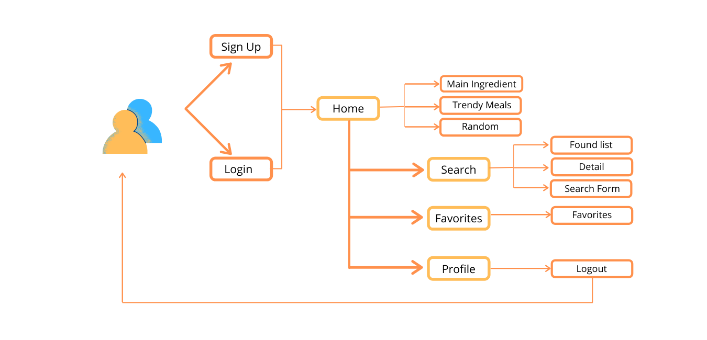

# MEAL & I


Check the website here: [Meal&I](https://meal-and-i.web.app/).

## Project Description

Application related to the culinary world, where the user can choose some ingredients available and recive some suggestion of dishes with chosen ingredients along with the preparation instructions.
Also, can check recipies based on main ingredient, trendy week meals or generate random meal, if you are out of inspiration. Moreover,  user can add favorites meals and have a pretty profile. 

### User Experience
User experience once logged in:
- Choose recipe by Main ingredient;
- Check and choose Trendy Meal;
- Generate Random Meal;
- Search recipes by multi-ingredient;
- Check detailed info of chosen dish;
- Add favorites
- Edit profile
#### User flow
;

### Tecnologies
;

### Data structure
```
user {
    uuid: uid,
    name: string,
    description: string,
    password: string,
    email: string
}

meal {
    strMeal: string,
    strMealThumb: string,
    idMeal: string,
    strInstructions: string,
    strMealThumb: string,
    strIngredient1: string,
    strIngredient2: string,
    strIngredient3: string,
    strIngredient4: string,
    strIngredient5: string,
    strIngredient6: string,
    strIngredient7: string,
    strIngredient8: string,
    strIngredient9: string,
    strMeasure1: string,
    strMeasure2: string,
    strMeasure3: string,
    strMeasure4: string,
    strMeasure5: string,
    strMeasure6: string,
    strMeasure7: string,
    strMeasure8: string,
    strMeasure9: string,
}

ingredient {
    idIngredient: string,
    strIngredient: string,
    strDescription: string
} 
```
## Product
      
